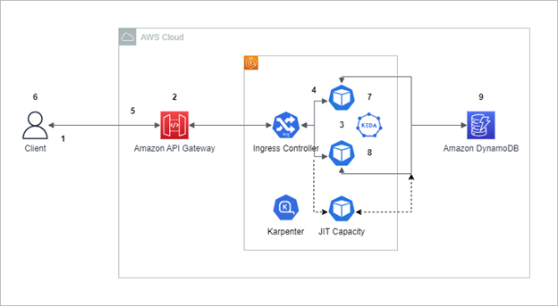

Introduction
------------
WebSocket is a common communication protocol used in web applications to facilitate real-time bi-directional data exchange between client and server. However, when the server has to maintain a direct connection with the client, it can limit the server's ability to scale down when there are long-running clients.  These scale down can occur when nodes are underutilized during periods of low usage.  

Overview of solution
--------------------

To overcome the scaling limitations resulting from open WebSocket connections a potential solution is to utilize Amazon API Gateway for establishing WebSocket connections with clients and communicating with the backend EKS services via a REST API, instead of than WebSocket.  Furthermore, to store session IDs for our application, Amazon DynamoDB will be leveraged. 

To implement this solution, we will create an Amazon API Gateway WebSocket API, which will manage incoming connections from the clients.  Clients can connect to the WebSocket API either through a custom domain name or the default API gateway endpoint.  The API gateway will be responsible for managing the lifecycle of the WebSocket connections and handles incoming messages from clients. 

When the client sends a message to the API gateway, the API gateway can then forward the message to the application running on EKS using a REST API CALL.  The EKS services can then process the message and send a response back to the API Gateway, which can then forward the response back to the client. 

By adopting this approach, the API gateway manages the WebSocket connections, which allows the EKS backend services to be scaled up or down as needed without impacting the clients. Since the API Gateway communicates with the EKS backed services using REST API calls instead of WebSockets, there are no open connections to prevent the termination of pods.  It's worth noting that Karpenter is not currently implemented in the walkthrough below, but it can be easily installed by referencing the official [documentation](https://karpenter.sh/docs/getting-started/getting-started-with-karpenter/).   

Walkthrough
-----------

1. The client initiates a WebSocket connection to the Amazon API Gateway

2. Amazon API Gateway receives the WebSocket connection request and creates a WebSocket session for the client.  Then API Gateway receives the message and routes it to the backend REST API running on Amazon EKS. 

3. The message will be sent to a pod in the cluster via Ingress Controller. AWS Load Balancer controller can be used as the ingress controller. The application running on the pod will determine if the session id exists in the DynamoDB table, and if it doesn't exist it will create a new item in the table

4. Then the application running on the pod will process the request and generates a response back to the API gateway.

5. API Gateway receives the response and forwards it to the client through the WebSocket connection.

6. The Client receives the response and can continue to send and receive messages through the WebSocket connection.

7. When there is a large number of WebSocket requests or increased message rates Kubernetes Event Driven Autoscaling (KEDA) will scale the the number of Kubernetes replica to handle the additional load based on events. See the Scaling EKS section below scaling details. 

8. Conversely when there is a drop in WebSocket request or decrease in message rates KEDA will scale down the number of Kubernetes replica and reduce the number of pods without issue since there are no open WebSocket connections. When a Kubernetes Pod needs to be scaled down, the SIGTERM signal ensures that the pod is terminated gracefully.

Implementation Steps
--------------------

<b>Prerequisites</b>

1. A EKS cluster

2. An ECR registry or equivalent docker registry to host the docker image (in this example we will use the ECR - websocket)

3. EKS will require the AWS Load Balancer Controller to be installed

4. A test machine with wscat client installed for testing.

5. IAM roles for service accounts needs to be configured for the Kubernetes deployment with the appropriate policy that will allow the pods to invoke an API call against the API Gateway.  You can following this [user guide](https://docs.aws.amazon.com/eks/latest/userguide/iam-roles-for-service-accounts.html) to setup IRSA, and this [policy](https://docs.aws.amazon.com/apigateway/latest/developerguide/api-gateway-iam-policy-examples-for-api-execution.html) to enable your pods to invoke the API call. 

<b>Steps</b>
1. Download the project files:

git clone <https://github.com/djiten75/websocket-eks/>

cd websocket-eks

2. Create the container image for a sample application. Go to the ECR registry and see the "view push commands". It will have instructions to build and push the docker image to ECR

3. Create and apply deployment file for service.

Replace <ecr image> with the location of your image in deployment-Service.yml

kubectl apply -f deployment-Service.yml

Run the following command to confirm the deployment was created successfully

kubectl get deployment websocket-microservice

4. Create Nodeport

kubectl apply -f nodePort-Service.yml

Run the following command to confirm the service was created successfully

kubectl get service websocket-restapp-nodeport-service

5. Create Ingress ALB

kubectl apply -f albIngress.yml

Run the following command to get the address for the ALB

kubectl get ingress ingress-websocket-restapp-service

6. Create Websocket API gateway by running the following command, please replace the address for the ALB with your own from the previous command in step 5

aws cloudformation create-stack --stack-name websocket-api --template-body file://./websocket-api-gateway-cfn.yml  --parameters ParameterKey=IntegrationUri,ParameterValue=http://<ALB Address>

7. Edit the update-deployment-Service.yml file and replace <IRSA ServiceAccount> with the Service Account name you have created as part of the prerequisite, and also update it with the correct container image

Run the following command to apply the update to the deployment

kubectl apply -f update-deployment-Service.yml

Update your IAM policy to grant the role only access to your API gateway and no additional resources as part of security best practices

8. Test with client. Please retrieve the API gateway URL from the cloudformation output and run the following command

wscat --connect wss://<Your API gateway url>

9. At the wscat prompt, type any message e.g. "hello" and it should echo back the message indicating end to end solution is working.

Cleanup
-------

Delete the cloudformation stack using the below command:

aws cloudformation delete-stack --stack-name websocket-api

Delete kubernetes resources:

              kubectl delete -f albIngress.yml

kubectl delete -f nodePort-Service.yml

kubectl delete -f deployment-Service.yml

Delete any other resources created as part of pre-requisite steps.

----
Copyright 2022 Amazon.com, Inc. or its affiliates. All Rights Reserved.

SPDX-License-Identifier: MIT-0
